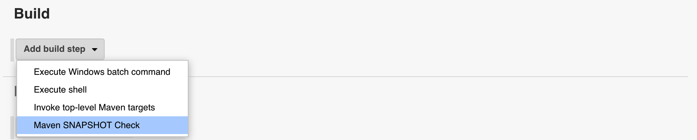
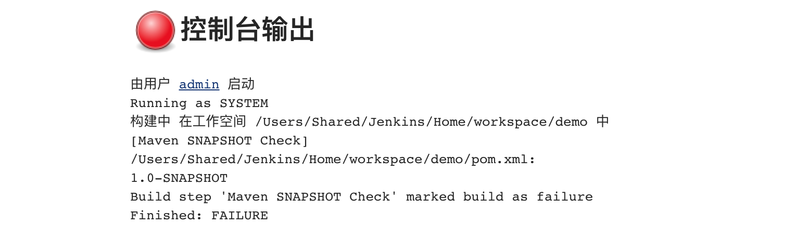
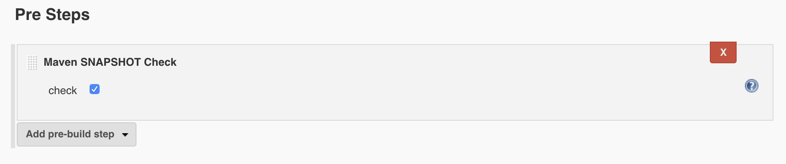

# Maven SNAPSHOT Check Plugin

[](https://ci.jenkins.io/job/Plugins/job/maven-snapshot-check-plugin/job/master/)
[](https://codecov.io/gh/jenkinsci/maven-snapshot-check-plugin)
[](https://plugins.jenkins.io/maven-snapshot-check)
[](https://github.com/jenkinsci/maven-snapshot-check-plugin/releases/latest)
[](https://plugins.jenkins.io/maven-snapshot-check)

[README 中文版](README.zh.md)

This plugin  used to check if pom.xml contains SNAPSHOT.


# Usage

## FreeStyle job usage

use the `Build Step` called `Maven SNAPSHOT Check` in `Build` section



If check the checkbox, it will check if pom.xml contains SNAPSHOT. 


Then it will marked the build failed if matches.



## Maven job usage

use the `pre-build step` called `Maven SNAPSHOT Check` in `Pre Steps` section


## Pipeline  job usage
```
step([$class: 'MavenSnapshotCheck', check: 'true'])
```
or
```
mavenSnapshotCheck check: 'true'
```
or, you can customize the pomFiles parameter to check only the specified pom files 
(If the pomFiles parameter is not defined, its default value is `pom.xml, * */pom.xml`)
```
mavenSnapshotCheck check: 'true', pomFiles: 'pom.xml,sub-dir/pom.xml'
```

# Bug reports
Please report bugs and feature requests at https://github.com/jenkinsci/maven-snapshot-check-plugin/issues.

# How to build and test
* Build the plugin:

`mvn package`

* Test locally (invokes a local Jenkins instance with the plugin installed):

`mvn hpi:run`

See https://jenkinsci.github.io/maven-hpi-plugin/ for details.
